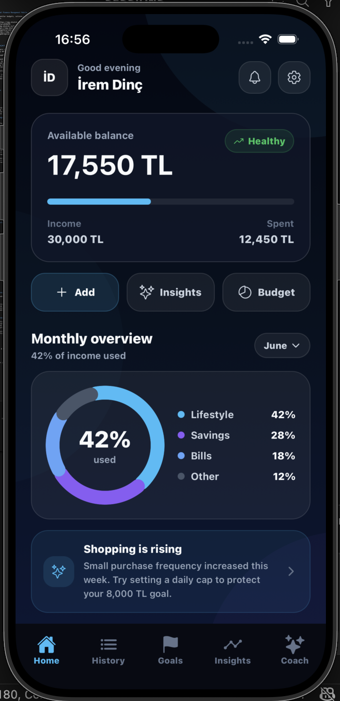
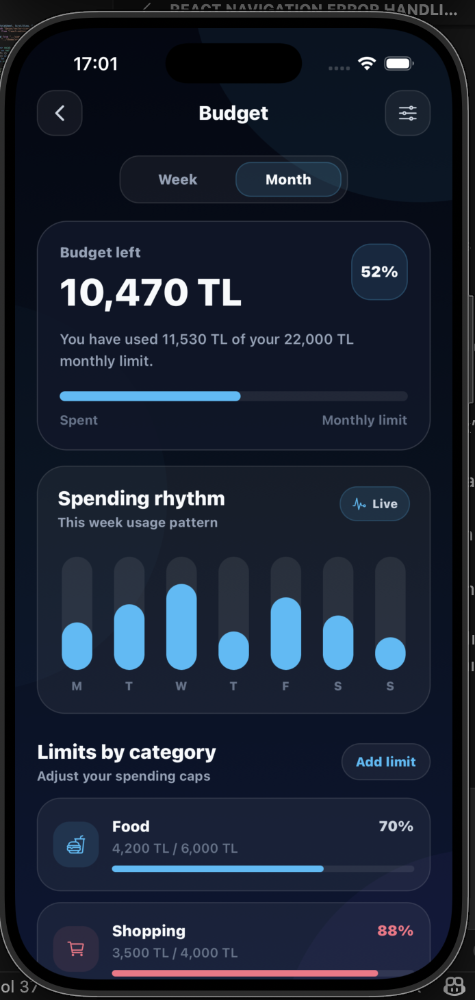
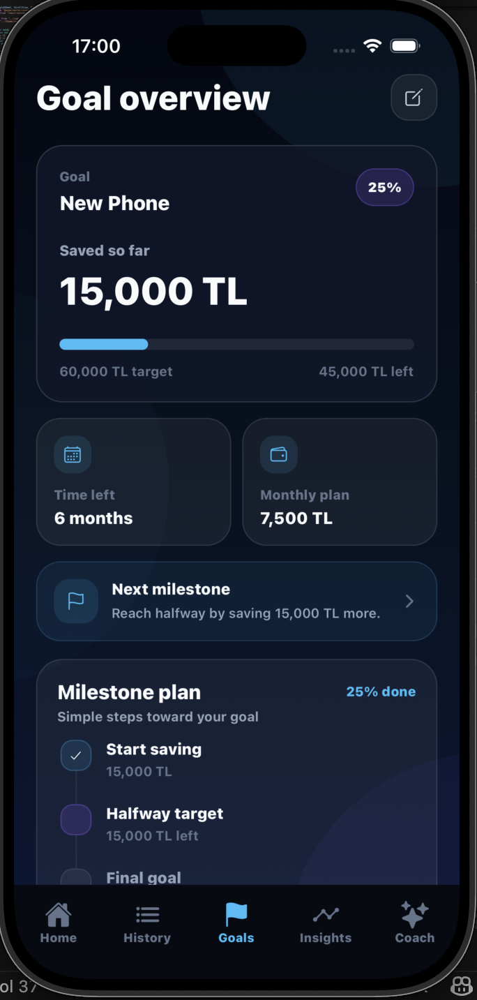
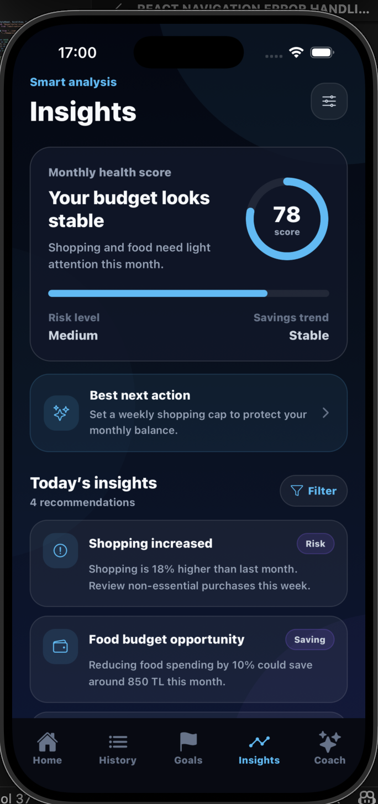
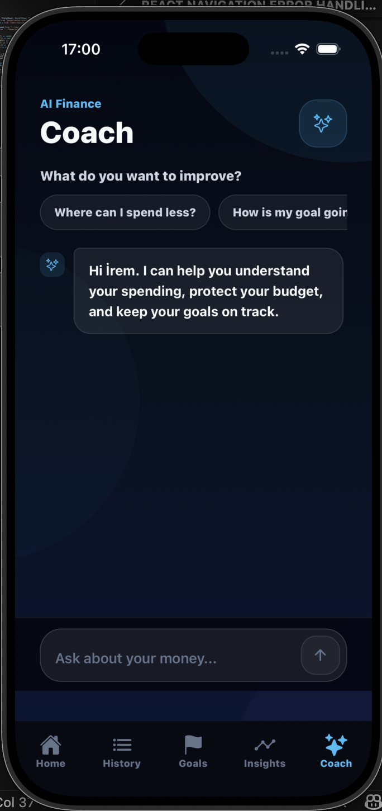
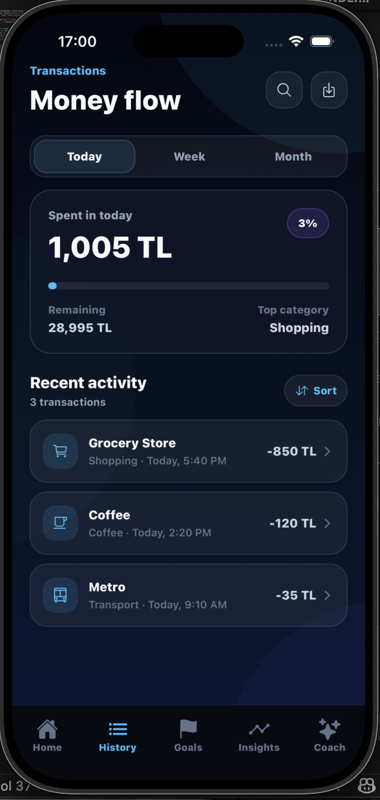

<div align="center">

# 💸 FinVibes

### Modern Personal Finance Management Mobile Application

Track expenses, monitor budgets, achieve financial goals, and gain AI-powered financial insights.


</div>

---

# 📱 About The Project

FinVibes is a modern personal finance tracking application designed to help users manage their money more effectively.

The application enables users to:

- Track expenses and income
- Monitor monthly spending
- Set financial goals
- Analyze spending habits
- Receive AI-powered financial insights

The project consists of:

- Mobile Frontend (React Native + Expo)
- Backend API (Spring Boot)
- PostgreSQL Database

---

# ✨ Features

### Authentication

- Welcome Screen
- Login
- Register
- Forgot Password

### Dashboard

- Total balance overview
- Monthly spending summary
- Recent transactions
- Spending progress

### Financial Management

- Add expenses
- Transaction history
- Financial goals
- Budget tracking

### AI Features

- Spending insights
- Smart financial recommendations
- AI coach section

---

# 📱 Application Screens

<div align="center">





</div>

<div align="center">





</div>


# 🛠 Tech Stack

## Mobile

- React Native
- Expo
- TypeScript

## Navigation

- React Navigation
- Bottom Tabs
- Native Stack

## UI

- Expo Linear Gradient
- Expo Vector Icons

## Backend

- Spring Boot
- PostgreSQL
- REST API

---

# 📂 Project Structure

```text
src/
├── components/
├── navigation/
├── screens/
├── theme/
├── assets/
└── constants/
```

---

# 🚀 Getting Started

### Clone the repository

```bash
git clone https://github.com/username/finvibes.git
```

### Install dependencies

```bash
npm install
```

### Start Expo

```bash
npx expo start
```

---

# 🎨 Design Philosophy

FinVibes uses a modern dark interface inspired by fintech applications.

Design goals:

- Clean user experience
- Minimal cognitive load
- Financial data visualization
- Modern fintech aesthetics

---

# 🔮 Future Improvements

- Backend integration
- JWT authentication
- Budget management
- Charts and analytics
- Notifications
- AI financial assistant
- Spending predictions

---

# 👩‍💻 Author

**İrem Dinç**

Computer Engineer • Backend Developer • AI Enthusiast

- LinkedIn
- GitHub

---

⭐ If you like this project, don't forget to give it a star.

